# 프로젝트명 : 던전라이크  

 

# [ 목차 ]
### 1. 게임명 : 던전라이크(개발자 : 김현우, 윤정현)
### 2. [컨셉](#1)
### 3. [관련 이미지와 동영상](#2)
### 4. [대표 이미지](#3)
### 5. [컨셉 and 대표이미지 기반 작품묘사](#4)
### 6. [던전라이크 구성요소](#5)
### 7. [게임시스템디자인](#6)
#### a. [게임오브젝트 분해](#61)
#### b. [파라이터(속성)](#62)
#### c. [행동](#63)
#### d. [상태](#64)
#### e. [플레이어 캐릭터 속성(파라미터)](#65)
#### f. [게임의 규칙](#66)
#### g. [게임에서 사용될 공식](#67)
### 8. [개발 요구사항 & 흐름도](#7)
#### a. [요구사항](#71)
#### b. [시간별 흐름도 flowchart](#72)
#### c. [키보드 이벤트에 대한 흐름도](#73)
#### d. [용어정리](#74)
### 9. [스토리보드](#8)
### 10. [프로트타입 개발 요구사항](#10)

 

# [컨셉]  
## 1. 메인컨셉 :  성취감    
● 유저가 던전을 클리어하면서 성취감을 느끼게 게임을 진행.    
● 턴제로 게임을 진행하여 전략적인 행동을 할 수 있게 여러 상호작용을 제작.  
● 게임 난이도가 낮으면 성취감을 느끼기 힘들어 난이도 상향.   
● 장르 : 턴제, 로그라이크, 전략.  
## 2. 서브컨셉 ⑴ : 속성    
● 아이템 및 Enemy에게 속성을 부여하여 상성을 부여한다.  
● 상성에 따른 버프와 디버프를 주는 특성을 부여한다.  
## 3. 서브컨셉 ⑵ : 턴제 시스템    
● Player에게 행동에 제한을 둔다.  
## 4. 서브컨셉 ⑶ : 한정적인 자원    
● Player가 들고 갈 수 있는 아이템에 제한을 둔다.  
● 아이템에 내구성 혹은 사용횟수를 제한을 둔다.   
● 한정적인 자원을 게임 난이도를 한층 증가시킨다.  
## 5. 서브컨셉 ⑷ : 미리보기   
● 던전의 사전정보를 어느정도 보여준다.  
● Player가 사전에 전략을 구성하게 해준다.  
## 6. 서브컨셉 ⑸ : 보스전  
● 성취감을 극대화 하기 위해 보스전을 제작한다.

  

# [관련 이미지와 동영상]  
#  ● 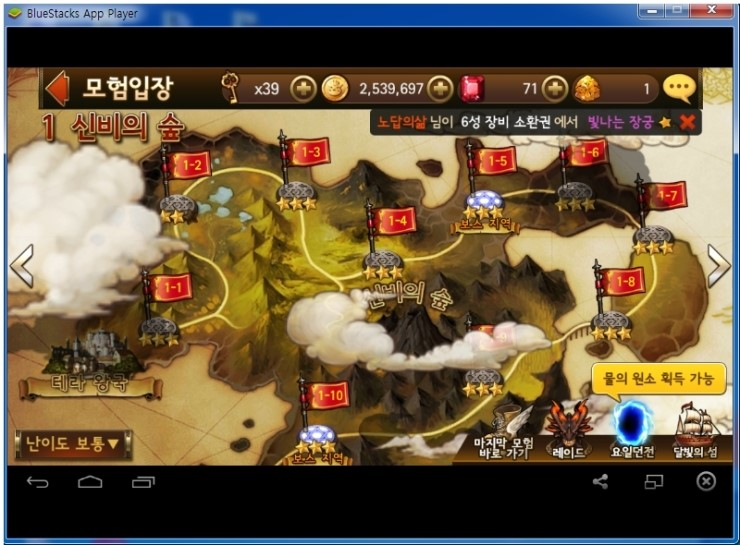 
   

# [대표이미지] 
#  ● 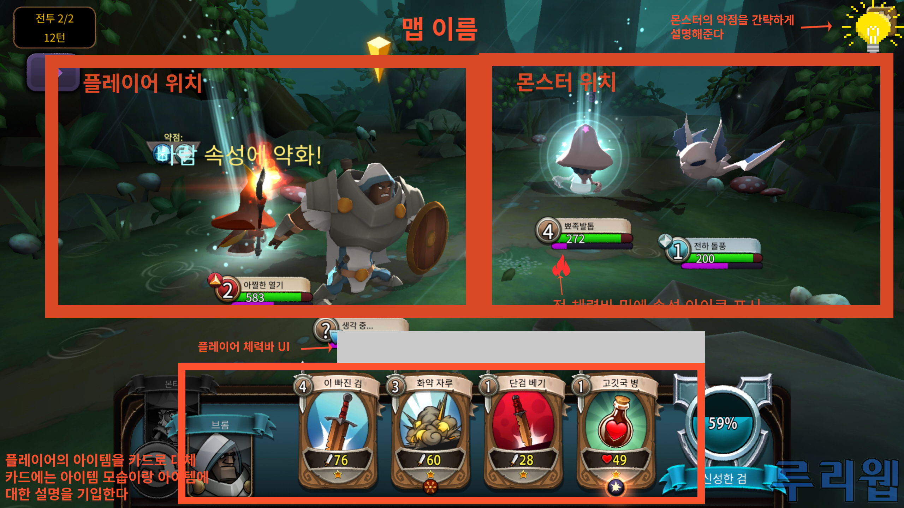 
 

# [컨셉 and 대표이미지 기반 작품묘사] 

# [던전라이크 구성요소] 

## 1.메커니즘
[도전 과제]
1. 스테이지별 몬스터를 상대로 승리하여 다음 스테이지로 이동한다.
2. 홈 맵의 상점에서 아이템을 구매, 다음 스테이지에서 활용할 아이템을 설정
3. 카드를 드래그 앤 드랍하여 상대 몬스터에게 공격을 하거나 자신에게 사용하여 좋은 효과를 부여
4. 보스 스테이지의 강력한 적을 분석 및 공략

[재미 요소]
1. 각종 아이템을 획득하고, 아이템을 분석하는 재미
2. 상대 몬스터의 약점, 속성을 분석하고 아이템의 전략적 사용으로 플레이어가 게임에 몰입
3. 카드를 직접 드래그 앤 드랍하여 적을 처치한다는 느낌을 직접적으로 표현
4. 스테이지별 뒷배경의 변화와 적의 외형 변화, 아이템 사용 이펙트를 통한 시각적인 재미

## 2. 이야기
[만들게 된 배경]

팀원 모두 전략형 게임 플레이를 선호하고, 이러한 전략적인 플레이를 기반으로 한 게임을 제작하고자 한다.
공격력이 강한 스킬만이 적에게 큰 타격을 주는 것이 아닌 적의 속성을 파악하여 적에게 맞는 공격을 해야
큰 타격을 줄 수 있는 포켓몬에서 해당 아이디어를 빌리고 각 순서에 사용할 수 있는 카드를 미리 홈에서 설정하여
유리하게 게임을 이어갈 수 있도록 하는 시스템을 더해 이러한 게임을 만들어보자고 하였고, 그리하여 많은 이들이
사랑하는 장르인 턴제 형 전략게임을 제작하고자 합니다.

[카메라 관점]

삼인칭 카메라 시점으로 게임을 진행하게 될 예정입니다.

## 3. 미적 요소

[디자인][컬러]

스테이지 별 배경을 다르게하여 고블린이 나오는 스테이지에는 뒤의 배경이 숲 혹은 늪지대와 같은 촉촉한 느낌을
살리고자 어두운 녹색 계열의 색을 많이 사욜할 것이며, 슬라임이 나오는 2-1 스테이지에서는 1 스테이지에서
나오는 늪지대에서 점차 벗어나는 듯한 밝은 녹색과 밝은색의 디자인을 할 것이고, 이후 석상 골렘과 수호자 석상이
나오는 스테이지에서는 대리석이나 낡은 석상의 디자인으로 게임 배경에 맞게 디자인할 것입니다.

[음향]

각 아이템의 속성에 따른 사용 효과음을 다르게 하고, 마을과 1 스테이지, 2 스테이지의 배경음악을 다르게 설정해
공간이 이동했음을 간접적으로 확인할 수 있도록 할 것입니다. 또한 상점에서 아이템을 구매할 때 동전 소리를 삽입하여
구매가 완료되었음을 알려주도록 합니다.

## 4. 기술

PC와 모바일에서 사용할 수 있도록 개발할 예정입니다. PC판에서는 마우스를 통해 드래그, 드랍을 할 수 있도록 개발할 것이고,
모바일판에서는 터치를 통해 드래그 및 드랍을 할 수 있도록 개발할 것입니다. 타 게임과는 달리 저사양으로 개발을 해 더 많은
사람이 이용할 수 있도록 개발할 것입니다.

 

# [게임 시스템 디자인] 
- - -

## 1. 게임 오브젝트 분해 (구성 요소 분석) 

|연번|오브젝트 이름|오브젝트 이미지|
|:----:|:----:|:----:|
|1|주인공|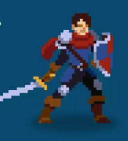|
|2|상인|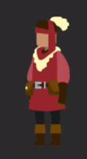|
|3|고블린 전사||
|4|고블린 궁수||
|5|고블린 친위대||
|6|고블린 왕||
|7|슬라임|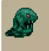|
|8|석상골렘|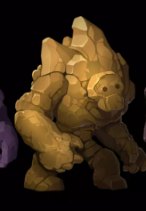|
|9|수호자석상|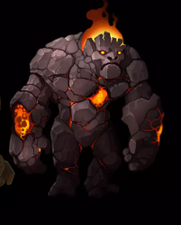|
|10|강철검|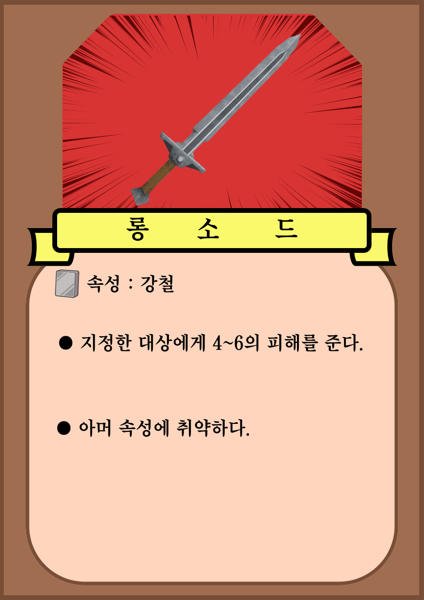|
|11|강철메이스|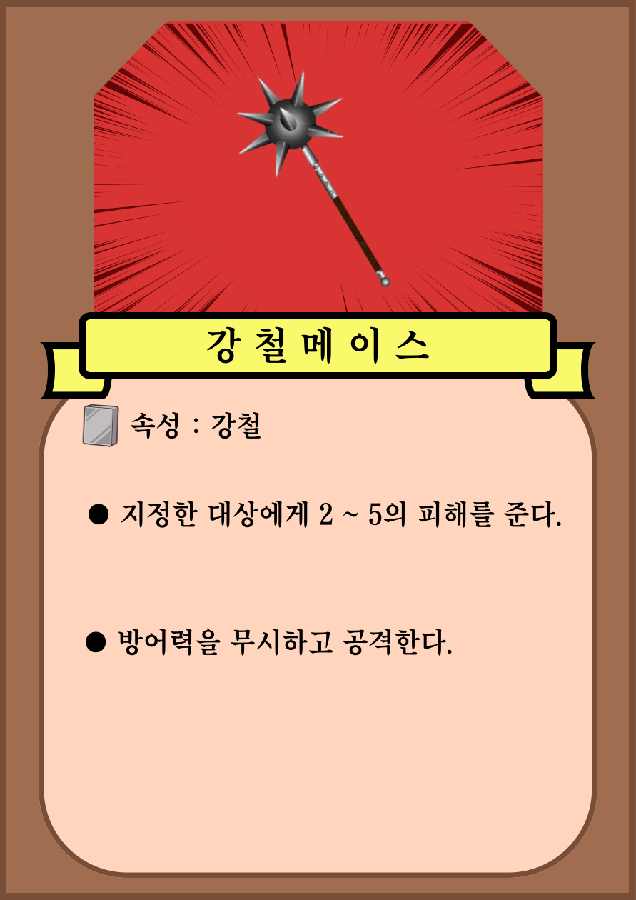|
|12|회복물약|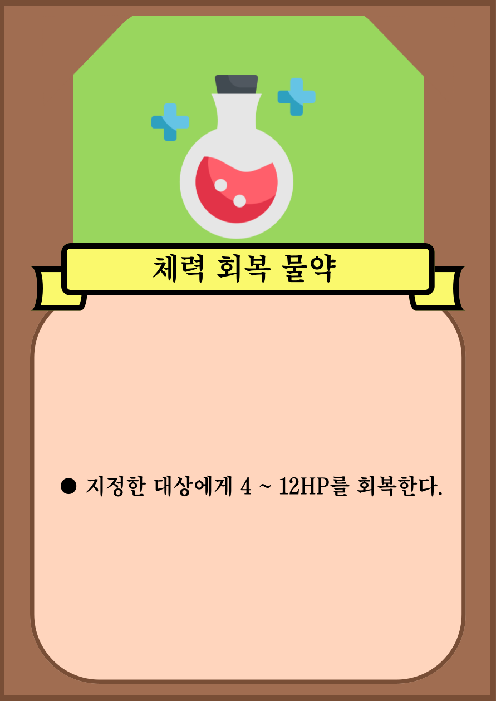|
|13|방패||
|14|쇠뇌|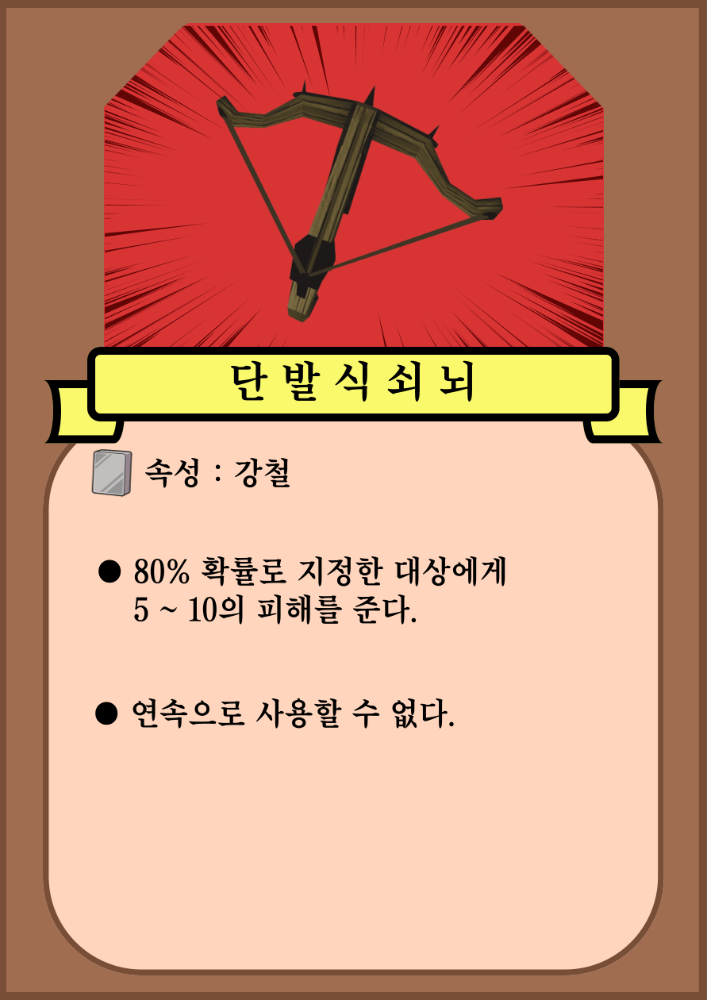|
|15|파이어 마법스크롤||
|16|화약통|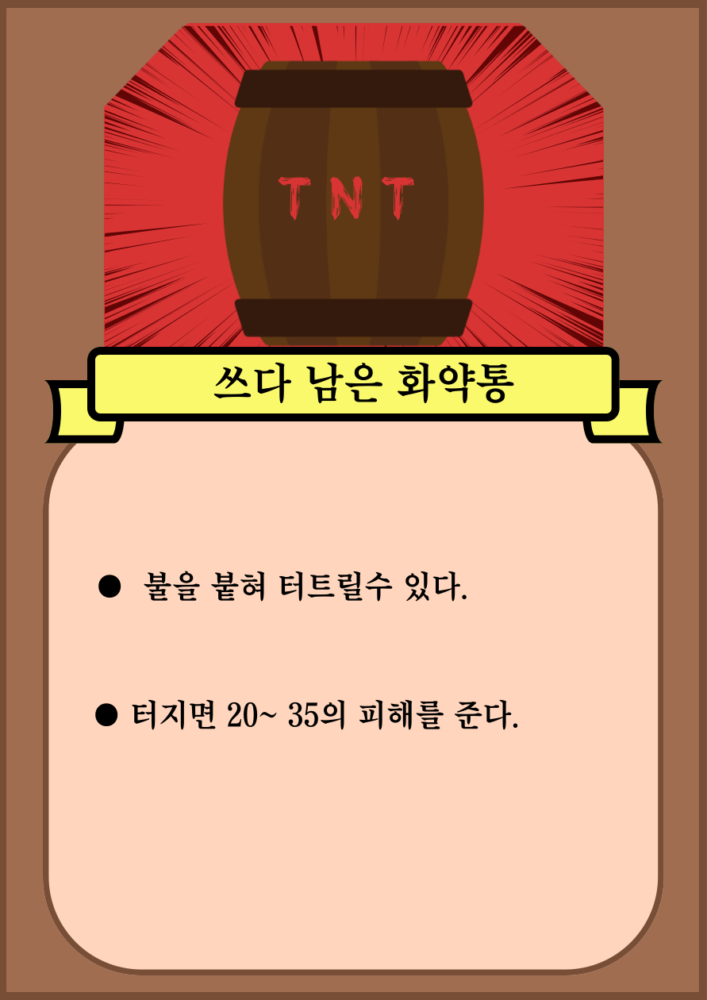|
|17|세계지도||
|18|가방|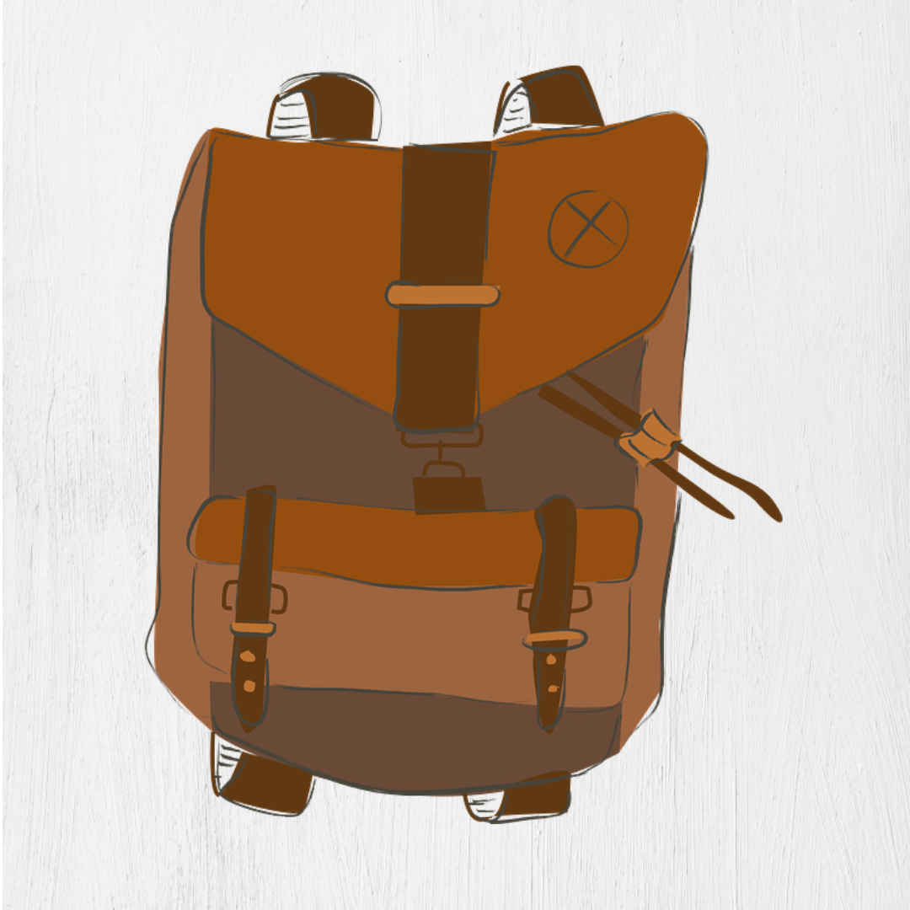|
|19|속성 아이콘||

 

## 2. 파라미터 (속성) 
### 1. 오브젝트 이름 : 김민수

|속성|영문명칭|설명|비고|
|:----:|:----:|:----:|:----:|
|체력|HP|플레이어의 고유체력||
|방어력|AM|플레이어의 고유 방어력||
|속성|Property|플레이어의 기본 속성||
|상태|state|플레이어의 현 상태||

 

### 2. 오브젝트 이름 : 모든 몬스터

|속성|영문명칭|설명|비고|
|:----:|:----:|:----:|:----:|
|체력|HP|각 몬스터의 고유 체력||
|방어력|AM|각 몬스터의 고유 방어력||
|속성|Property|각 몬스터의 고유 속성||
|상태|state|각 몬스터의 현재 상태||
|공격력|ap|각 몬스터의 기본 공격력||
|스킬|skill|각 몬스터의 공격 스킬||

 

### 3. 오브젝트 이름 : 모든 아이템

|속성|영문명칭|설명|비고|
|:----:|:----:|:----:|:----:|
|속성|Property|각 아이템 고유 속성||
|사용횟수|nou|각 아이템의 사용가능 횟수||
|공격력|ap|각 아이템의 기본 공격력||
|적중률|HR|특정 아이템의 적중률||
|회복|RC|특정 아이템의 회복률||
|효과|effect|각 아이템의 고유 능력||
|금액|amount|기본 아이템을 제외한 상점에서 구매할때의 금액||

 

### 4. 오브젝트 이름 : 상인

|속성|영문명칭|설명|비고|
|:----:|:----:|:----:|:----:|
|상품|product|상인의 상품 목록||
|보유골드|Gold|플레이어의 골드량||
|구매 버튼|PB|제품 구매 버튼||

  

## 3. 행동 
### 1. 오브젝트 이름 : 김민수

|행동|설명|
|:----:|:----:|
|기본|플레이어 기본 행동|
|공격|플레이어가 카드로 적을 공격하는 행동|
|피격|플레이어가 적에게 공격받는 행동|
|사망|플레이어 HP 0이 되어 사망하는 행동|
|구매|플레이어가 상점에서 구매하는 행동|

 

### 2. 오브젝트 이름 : 모든 몬스터

|행동|설명|
|:----:|:----:|
|기본|몬스터 기본 행동|
|공격|몬스터가 플레이어를 공격하는 행동|
|피격|몬스터가 플레이어에게 공격받는 행동|
|사망|몬스터 HP 0이 되어 사망하는 행동|

 

### 3. 오브젝트 이름 : 모든 아이템

|속성|영문명칭|설명|비고|
|:----:|:----:|:----:|:----:|
|속성|Property|각 아이템 고유 속성||
|사용횟수|nou|각 아이템의 사용가능 횟수||
|공격력|ap|각 아이템의 기본 공격력||
|적중률|HR|특정 아이템의 적중률||
|회복|RC|특정 아이템의 회복률||
|효과|effect|각 아이템의 고유 능력||
|금액|amount|기본 아이템을 제외한 상점에서 구매할때의 금액||

 

## 4. 상태 

### 1. 오브젝트 이름 : 김민수

|현상태|전이상태|전이조건|
|:----:|:----:|:----:|
|기본 상태(Idle)|기본 상태(Idle)|아무 행동도 하지 않는 상태|
|기본 상태(Idle)|공격|카드 드래그 앤 드롭|
|기본 상태(Idle)|피격|기본 상태에서 공격받을 시|
|기본 상태(Idle)|사망|기본 상태에서 HP가 0이 될 시|
|기본 상태(Idle)|기절|기본 상태에서 상태이상 공격을 받을 시|
|기본 상태(Idle)|구매|상점에서 골드를 소비하여 물건을 구매 할 시|

 

### 2. 오브젝트 이름 : 모든 몬스터

|현상태|전이상태|전이조건|
|:----:|:----:|:----:|
|기본 상태(Idle)|기본 상태(Idle)|아무 행동도 하지 않는 상태|
|기본 상태(Idle)|공격|기본 상태에서 자동으로 플레이어를 공격할 시|
|기본 상태(Idle)|피격|기본 상태에서 공격 받을 시|
|기본 상태(Idle)|사망|기본 상태에서 HP가 0이 될 시|
|기본 상태(Idle)|기절|기본 상태에서 상태이상 공격을 받을 시|

 

## 5. 플레이어 캐릭터 속성 (파라미터) 

|속성|영문명칭|설명|비고|
|:----:|:----:|:----:|:----:|
|체력|HP|플레이어가 체력이 0이 되면 기본맵으로 귀환||
|방어력|AM|플레이어가 받는 데미지를 감소 시켜준다.||
|속성|Property|플레이어의 기본 속성||
|상태|state|플레이어의 현 상태||

 

## 6. 게임의 규칙 

### [핵심 규칙]
1.플레이어는 기본카드 5장을 받고 기본맵에서 게임을 시작한다.

  1-1 카드에는 고유 능력과, 데미지, 속성이 있다.
  
2.플레이어는 기본맵에서 세계지도 아이콘을 클릭하여 지도맵으로 씬을 전환 할 수 있다.

3.지도맵에서 플레이어는 기본맵과 던전맵을 자유롭게 이동가능하다.

4.던전맵에 들어가기전에 사전정보를 확인할 수 있다.

5.플레이어는 사전정보를 확인하여 자신의 '덱'(아이템)을 및 전략을 수정하여 들어갈 수 있다.

6.던전맵에 들어오면 플레이어는 좌측에서 게임을 시작하고 우측에는 몬스터들로 구성되어있다.

7.몬스터들과 플레이어의 카드들은 각각 고유 속성있고 속성마다 카운터 속성이 있다.

8.게임은 턴제로 진행되며 플레이어의 전투방식은 대상에게 카드를 드래그 앤 드롭으로 데미지를 준다.

  8-1 플레이어가 1회 공격 시 플레이어의 턴이 종료되며 몬스터에게 턴이 넘어간다.
  
9.플레이어의 체력이 0 되거나 몬스터를 다 잡으면 스테이지가 종료되고 플레이어가 승리하면 다음스테이지로
  패배하면 기본맵으로 돌아간다.
  
  9-1 플레이어가 보스스테이지 까지 클리어하면 기본맵으로 돌아갈 수 있다.
  
10.플레이어가 스테이지를 클리어 하면 골드를 획득 할 수 있다. 획득한 골드로는 상점에서 카드를 구매하여 덱
  파워를 강하게 업그레이드 할 수 있다.
  
  10-1 플레이어가 낮은 스테이지에서 반복적으로 골드를 수급해 게임의 밸런스를 파괴하는 것을 막기 위해
       강력한 카드들은 해금 조건을 둬 밸런스 파괴를 억제한다.

 

### [보조 규칙]
 1. 스테이지는 3단계로 나뉘어있고 마지막 단계가 보스스테이지 이다.
 

 

## 7. 게임에서 사용될 공식   
1. playerHp = 플레이어 체력 playerHp <=0 되면 게임오버
2. 카드를 드래그 앤 드롭 하여 카드 collider가 몬스터 collider과 충돌하면 카드 
  안에 있는 속성값을 가져와 데미지를 계산한뒤 monHP  - 데미지 한다.
3. 카드가 collider가 충돌할 때 마다 count 하여 내구도를 소모하면 카드를 Distroy한다
4. tag“monster”가 맵에 없으면 씬을 전환한다 
5. 보스맵에서 tag“boss”and“monster”가 없으면 메인화면으로 씬을 전환하고 Gold를 지급한다
6. buy = Gold – 카드가격 boy >=0 면 카드를 구매할수 있다
7. 카드를 클릭하면 mydeck에 카드의 고유 번호를 저장하고 전투맵에서 accard에게 카드 고유 번호를 보내고 저장한다.

### [각 스테이지 전투]
- 플레이어의 카드 데미지 – 적의 체력 (result)
- result 값이 0보다 크면 적을 처치
- 적은 죽고 초기화상태로 전환한다.

  

# [개발 요구사항 & 흐름도] 
- - -  

## 7-1. 요구사항 

### 인게임 요구사항  
1-1시작화면, 메인화면, 지도화면, 던전화면, 상점화면, 카드화면, 총 6개 화면으로 구성되어 있습니다.

1-2 시작화면은 배경으로 게임 일러스트가 들어가 있고 화면 중앙에 게임의 타이틀이 적혀있고 타이틀 밑에 게임시작, 옵션 버튼이 있습니다.

1-3 메인화면에는 숲속을 배경으로 좌중단에 모닥불 그 옆에 모닥불을 쬐고 있는 주인공 캐릭터가 있고 모닥불 과 주인공캐릭터 사이 뒤에 상단 마차 모습으로 상점이 있고 오른쪽 숲속 뒤 배경으로 거대한 성채가 보입니다.

1-4 메인화면에서 상단 마차를 클릭하면 상점으로 이동하고, 주인공 캐릭터를 클릭하면 자신의 덱을 정비 할수 있고마지막으로 거대한 성채를 클릭하면 지도화면으로 이동됩니다.

1-5 상점화면에서는 우상단에는 플레이어의 재화를 표시하는 골드코인 모양의 아이콘과 아이콘 옆에는 보유하고 있는재화량이 있습니다. 화면 중앙에는 카드들이 구비되어있고 카드 밑에는 가격과 이름이 쓰여있습니다. 몇몇의 카드들은 구매불가 라고 쓰여있습니다.

1-6 상점화면에서는 ESC키를 누르면 메인화면으로 이동할 수 있습니다.

1-7 카드화면에서는 화면 왼쪽에는 자신이 사용할 덱이 있고 덱은 총 5 파트로 나뉘어져있고
    한 파트당 총 5개의 카드를 등록할 수 있습니다. 화면 오른쪽에는 보유하고 있는 카드가 있습니다. 보유하고있는카드를 클릭하면 등록할수 있습니다.
    
1-8 카드화면에서는 ESC키를 누르면 메인화면으로 이동할 수 있습니다.

1-9 지도화면에서는 화면이 3구역으로 나뉘어져있고 맨 왼쪽부터 1스테이지 중앙 2스테이지 맨 오른쪽 3스테이지가있습니다. 1스테이지를 클리어하지 않았다면 2스테이지와 3스테이지는 자물쇠 아이콘이 각각 스테이지 가운데에 위치해있으면 해당스테이지를 플레이 할 수 없습니다.

1-10 지도화면에서 1스테이지를 클릭하면 1스테이지의 사전정보이 나오면 사전정보 밑에는 도전하기 버튼이 생성됩니다. 버튼을 클릭하면 1-1 스테이지에 진입합니다.

1-11 모든 스테이지는 3개의 전투맵으로 구성되어있고 마지막 맵이 보스맵입니다.

1-12 전투는 턴제로 진행되며 화면 좌측에 플레이어 우측에 몬스터가 있고 화면 중앙 하단에 덱에 있던 카드들이 나와있습니다. 화면 중앙 상단에는 1-1 던바튼 평원이 라는 맵 이름이 나옵니다.

1-13 전투는 플레이어가 선공으로 카드를 드래그 앤 드롭하여 카드의 효과를 몬스터 혹은 플레이어에게 적용합니다.

1-14 각 몬스터와 카드에는 속성이 있습니다. 속성에 따라 카드가 몬스터에게 주는 데미지를 계산합니다. 

1-15 몬스터가 피격당할 때 마다 몬스터의 색깔이 빨개졌다가 다시 돌아오는 식으로 피격모습을 보여줍니다.

1-16 몬스터의 HP가 다 소모되면 몬스터가 화면에서 사라집니다. 화면에 있는 모든 몬스터를 제거하면 다음 맵으로이동합니다.

1-17 몬스터는 플레이어 턴이 끝나고 1마리당 한번씩 플레이어를 공격하거나 자신의 스킬을 사용합니다.

1-18 1스테이지는 평원과 고블린부락으로 이 배경으로 구현합니다.

1-19 1-1 스테이지는 평원을 배경으로 고블린 전사 3마리가 몬스터로 나옵니다. 고블린전사의 기본 공격력은 3이고 명중률이 45%이고 기본 체력이 12입니다. 속성은 노말입니다.

1-20 1-2 스테이지는 고블린 부락 외곽을 배경으로 고블린 전사 2마리와 고블린 아처 3마리가 몬스터로 나옵니다. 고블린 아처의 기본 공격력은 5이고 명중률이 50%이고 기본체력이 8입니다 속성은 노말입니다.

1-21 1-3 스테이지는 보스 맵이며 고블린 부락의 중앙을 배경으로 고블린 친위대 3마리와 고블린 왕이 몬스터로 나옵 니다. 고블린 친위대는 기본 공격력이 7이고 명중률은 70%이고 기본체력이 20입니다. 고블린 친위대는 아머속성을 가지고있습니다. 고블린 킹은 플레이어를 공격할 수 없지만 매턴 고블린 친위대의 HP를 3 회복합니다. 그리고 고블린 친위대를 먼저 제거하지 않으면 고블린 킹을 공격 할 수 없습니다.

1-22 보스맵을 클리어하면 메인화면으로 이동하면서 재화를 수령합니다. 재화는 상점에서 카드를 구매하는데 사용할 수 있습니다. 또한 상점화면으로 가면 기존에 구매불가인 카드들이 구매가능으로 해제됩니다.

1-23 스테이지를 클리어하면 카드화면에서 추가 덱 파트 1개를 더 사용할 수 있게 됩니다.

1-24 스테이지는 동굴과 고대 사원 가는 길을 배경으로 구현합니다.

1-25 2-1 스테이지는 동굴을 배경으로 슬라임 3마리가 몬스터로 나옵니다. 슬라임은 기본 공격력 1이고 명중률이100% 기본체력이 12입니다. 속성은 산성입니다.

1-26 2-2 스테이지는 동굴 끝과 고대사원의 잔해들이 보이는 배경으로 석상골렘 4마리가 나옵니다.
     석상골렘은 기본공격력 4이고 명중률은 60% 기본체력은 25입니다. 속성은 바위입니다.
     
1-27 2-3 스테이지는 고대사원의 입구를 배경으로 석상 골렘 2마리와 가디언이 몬스터로 나옵니다
     가디언은 기본공격력이 10이고 명중률은 70% 기본체력은 50입니다. 속성은 바위입니다.
     추가적으로 가디언이 생존했을 때 석상골렘을 잡으면 가디언의 체력이 전부 회복 됩니다.
     
1-28 3 스테이지는 고대사원을 배경으로 구현합니다. 

1-29 3-1 스테이지는 고대사원의 내부를 배경으로 불의 정령 1마리 물의 정령 1마리 땅의 정령 1마리 풀의 정령 1마리가 나옵니다. 각 정령의 기본공격력은 4이고 명중률은 100%입니다. 기본체력은 15로입니다. 속성은 각각 불,물, 땅, 풀입니다.

1-30 3-2 스테이지는 고대사원의 내부에 있는 큰 광장을 배경으로 수정구 4개가 몬스터로 나옵니다. 수정구는 스스로공격을 할수 없으며 체력은 50입니다. 속성은 각각 불, 물, 땅, 풀입니다.

1-31 3-3 스테이지는 거대한 기둥들과 쇠사슬이 배경으로 고대의 악마가 보스로 나옵니다
     고대 악마는 기본공격력이 50 명중률은 100% 체력은 100입니다. 빛을 제외한 모든속성 면역입니다.
     
1-32 엔딩씬을 구현합니다.

1-33 희든 엔딩씬을 구현하고 엔딩분기 스테이지에서 필요로하는 플레이어와의 상화작용하는 

1-34 오브젝트에 기능을 구현합니다.

1-35 게임의 음향을 조절할 수 있는 기능을 구현합니다.

1-36 게임의 저장 기능을 구현합니다.

1-37 게임 제출전에 게임을 배포하여 피드백을 받아 게임을 수정합니다.

1-38 수정한 게임의 오류 및 수정사항을 재검토합니다.

1-39 최종본 제작을 마무리 하고 오류 및 수정사항을 재검토 합니다. 

## 7-2. 시간별 흐름도 flowchart   
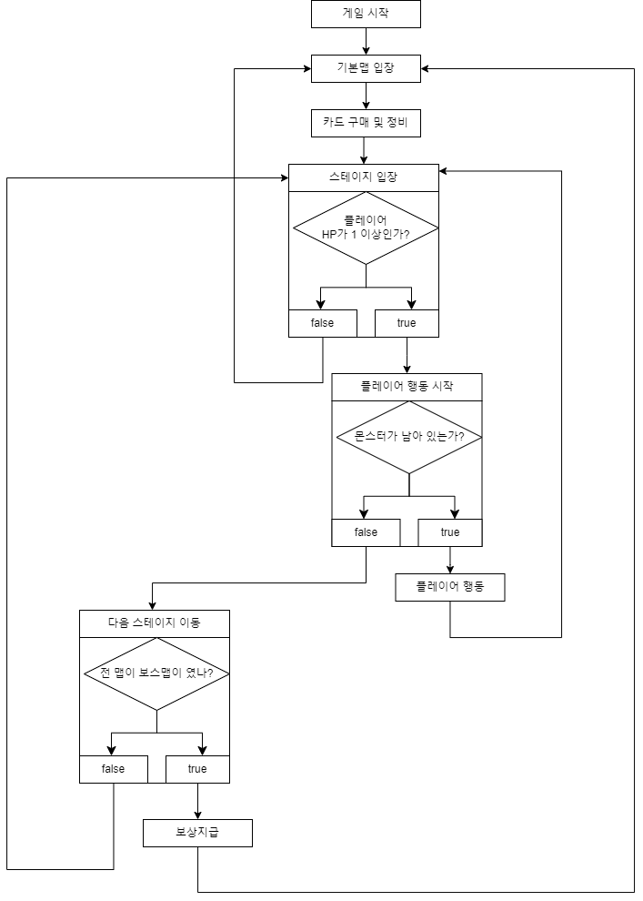  

## 7-3. 키보드 이벤트에 대한 흐름도   
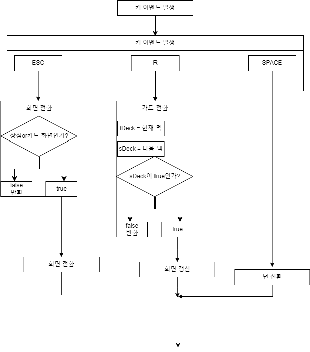  

## 7-4. 용어정리   
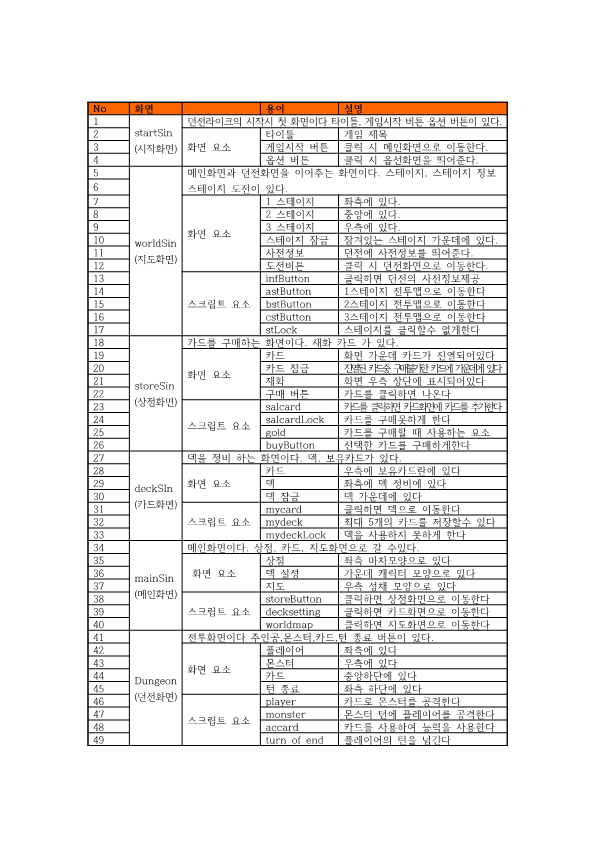  

 

# [스토리보드]   
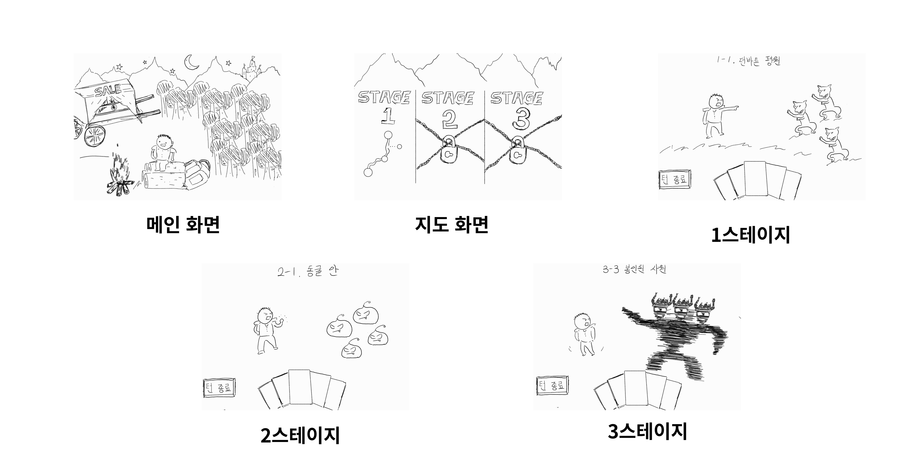 

 

# [스토리보드]   

## 10.프로토타입 개발 요구사항(6주개발) 

## 11.프로토타입 개발작업 일정(6주개발) 

