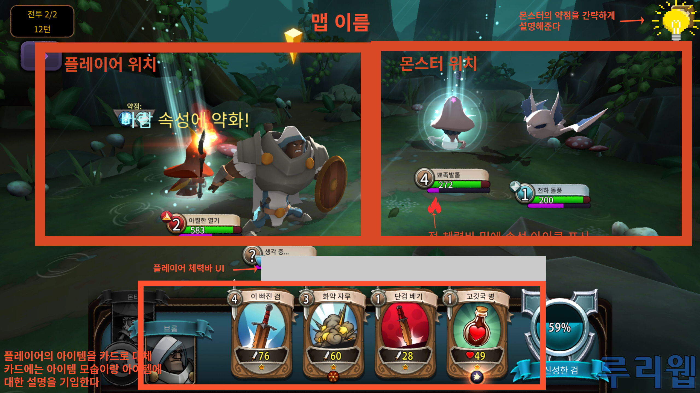

# 프로젝트명 : 던전라이크  
# [컨셉]  
## 1. 메인컨셉 : 성취감
● 유저가 던전을 클리어하면서 성취감을 느끼게 게임을 진행.
● 턴제로 게임을 진행하여 전략적인 행동을 할 수 있게 여러 상호작용을 제작.
● 게임 난이도가 낮으면 성취감을 느끼기 힘들어 난이도 상향.
● 장르 : 턴제, 로그라이크, 전략.
## 2. 서브컨셉 ⑴ : 속성
● 아이템 및 Enemy에게 속성을 부여하여 상성을 부여한다.
● 상성에 따른 버프와 디버프를 주는 특성을 부여한다.
## 3. 서브컨셉 ⑵ : 턴제 시스템
● Player에게 행동에 제한을 둔다.
## 4. 서브컨셉 ⑶ : 한정적인 자원
● Player가 들고 갈 수 있는 아이템에 제한을 둔다.
● 아이템에 내구성 혹은 사용횟수를 제한을 둔다.
● 한정적인 자원을 게임 난이도를 한층 증가시킨다.
## 5. 서브컨셉 ⑷ : 미리보기
● 던전의 사전정보를 어느정도 보여준다.
● Player가 사전에 전략을 구성하게 해준다.
## 6. 서브컨셉 ⑸ : 보스전
● 성취감을 극대화 하기 위해 보스전을 제작한다.

  

# [관련 이미지 & 동영상]
# ● 

# [<던전라이크> 구성 요소]

## 1.메커니즘
[도전 과제]
1. 스테이지별 몬스터를 상대로 승리하여 다음 스테이지로 이동한다.
2. 홈 맵의 상점에서 아이템을 구매, 다음 스테이지에서 활용할 아이템을 설정
3. 카드를 드래그 앤 드랍하여 상대 몬스터에게 공격을 하거나 자신에게 사용하여 좋은 효과를 부여
4. 보스 스테이지의 강력한 적을 분석 및 공략

[재미 요소]
1. 각종 아이템을 획득하고, 아이템을 분석하는 재미
2. 상대 몬스터의 약점, 속성을 분석하고 아이템의 전략적 사용으로 플레이어가 게임에 몰입
3. 카드를 직접 드래그 앤 드랍하여 적을 처치한다는 느낌을 직접적으로 표현
4. 스테이지별 뒷배경의 변화와 적의 외형 변화, 아이템 사용 이펙트를 통한 시각적인 재미

## 2. 이야기
[만들게 된 배경]

팀원 모두 전략형 게임 플레이를 선호하고, 이러한 전략적인 플레이를 기반으로 한 게임을 제작하고자 한다.
공격력이 강한 스킬만이 적에게 큰 타격을 주는 것이 아닌 적의 속성을 파악하여 적에게 맞는 공격을 해야 
큰 타격을 줄 수 있는 포켓몬에서 해당 아이디어를 빌리고 각 순서에 사용할 수 있는 카드를 미리 홈에서 설정하여
유리하게 게임을 이어갈 수 있도록 하는 시스템을 더해 이러한 게임을 만들어보자고 하였고, 그리하여 많은 이들이
사랑하는 장르인 턴제 형 전략게임을 제작하고자 합니다.

[카메라 관점]

삼인칭 카메라 시점으로 게임을 진행하게 될 예정입니다.

## 3. 미적 요소

[디자인][컬러]

스테이지 별 배경을 다르게하여 고블린이 나오는 스테이지에는 뒤의 배경이 숲 혹은 늪지대와 같은 촉촉한 느낌을
살리고자 어두운 녹색 계열의 색을 많이 사욜할 것이며, 슬라임이 나오는 2-1 스테이지에서는 1 스테이지에서
나오는 늪지대에서 점차 벗어나는 듯한 밝은 녹색과 밝은색의 디자인을 할 것이고, 이후 석상 골렘과 수호자 석상이
나오는 스테이지에서는 대리석이나 낡은 석상의 디자인으로 게임 배경에 맞게 디자인할 것입니다.

[음향]

각 아이템의 속성에 따른 사용 효과음을 다르게 하고, 마을과 1 스테이지, 2 스테이지의 배경음악을 다르게 설정해
공간이 이동했음을 간접적으로 확인할 수 있도록 할 것입니다. 또한 상점에서 아이템을 구매할 때 동전 소리를 삽입하여
구매가 완료되었음을 알려주도록 합니다.

## 4. 기술

PC와 모바일에서 사용할 수 있도록 개발할 예정입니다. PC판에서는 마우스를 통해 드래그, 드랍을 할 수 있도록 개발할 것이고,
모바일판에서는 터치를 통해 드래그 및 드랍을 할 수 있도록 개발할 것입니다. 타 게임과는 달리 저사양으로 개발을 해 더 많은
사람이 이용할 수 있도록 개발할 것입니다.

 

## 2. 파라미터 (속성) 
### 1. 오브젝트 이름 : 김민수

|속성|영문명칭|설명|비고|
|:----:|:----:|:----:|:----:|
|체력|HP|플레이어의 고유체력||
|방어력|AM|플레이어의 고유 방어력||
|속성|Property|플레이어의 기본 속성||
|상태|state|플레이어의 현 상태||

 

### 2. 오브젝트 이름 : 몬스터(메탄가스, 이산화탄소, 이산화질소, 인간)

|속성|영문명칭|설명|비고|
|:----:|:----:|:----:|:----:|
|체력|M_HP|HP가 0이 되면 사망한다.||
|스피드|M_Speed|몬스터의 이동 속도를 설정한다..||
|상태|M_Status|몬스터의 행동 상태. 공격, 이동, 피격, 사망을 확인한다.||
|컬러|M_Hcolor|몬스터가 피격당했을 시 색이 변환된다.||
|드랍 아이템|M_Drop|몬스터가 사망할 때 드랍할 아이템을 저장한다.||

 

### 3. 오브젝트 이름 : 무기(방망이)

|속성|영문명칭|설명|비고|
|:----:|:----:|:----:|:----:|
|공격력|WP_Damage|무기의 공격력은 30. 강화 단계가 올라갈 때마다 데미지가 5씩 올라간다.||
|강화 수치|WP_Enforce|무기의 강화 수치, 1~6까지의 단계가 있으며 1단계가 가장 좋은 단계이다.||
|내구도|WP_Durability|무기의 내구도를 나타낸다.||
|강화 확률|WP_Probability|무기의 강화 확률. 6단계에서의 강화 확률은 70%이고, 단계가 올라갈 때마다 10%씩 확률이 줄어든다.||

 

### 4. 오브젝트 이름 : UI(인벤토리, 재활용품 보관, 호감도 수치, 지구온난화 수치)

|속성|영문명칭|설명|비고|
|:----:|:----:|:----:|:----:|
|호감도 상승|Like_Up|퀘스트를 수행했을 때 호감도 수치가 상승한다.||
|호감도 하락|Like_Down|퀘스트를 실패했을 때 호감도수치가 하락한다.||
|지구온난화 수치 상승|GW_Up|재활용을 실패했을 때와 몬스터에게 죽었을 때 상승한다.||
|지구온난화 수치 하락|GW_Down|재활용을 성공했을 때 하락한다.||

 

### 5. 오브젝트 이름 : 재활용 센터

|속성|영문명칭|설명|비고|
|:----:|:----:|:----:|:----:|
|재활용 성공|Re_Succes|재활용에 성공했을 때 온난화 수치가 하락한다.||
|재활용 실패|Re_Fail|재활용에 실패했을 때 온난화 수치가 상승한다.||
|재활용 실패 이펙트|Re_Fail_Effect|재활용에 실패했을 때 발생하는 효과||
|재활용품 확인|Re_Check|맞는 재활용품을 떨어트렸는지 확인한다.||

  

## 3. 행동 
### 1. 오브젝트 이름 : 플레이어(웅)

|행동|설명|
|:----:|:----:|
|앞으로 이동|W키 입력 시 바라보고 있는 방향으로 이동|
|좌우 이동|A키, D키 입력 시 방향 좌(A),우(D)로 이동|
|뒤로 이동|S키 입력 시 바라보고 있는 방향의 뒤쪽으로 이동|
|공격|무기 보유 중에 C키 입력 시 무기를 휘두르며 공격|
|상호작용|E키 입력 시 주민들과의 퀘스트나 대화 진행|
|아이템 줍기|G키 입력 시 바닥에 떨어져 있는 재활용품이나 쓰레기를 줍는다.|

 

### 2. 오브젝트 이름 : 몬스터(메탄가스, 이산화탄소, 이산화질소, 인간)

|행동|설명|
|:----:|:----:|
|공격|플레이어가 범위내에 들어올 경우 공격|
|피격|플레이어의 공격에 맞았을 때 몬스터가 빨간색으로 변함|
|사망|몬스터의 HP가 0이 되었을 때 사망|
|순찰|몬스터가 플레이어가 범위 내에 들어오기 전까지 정해진 구역을 순찰|

 

### 3. 오브젝트 이름 : 괴짜펭귄

|행동|설명|
|:----:|:----:|
|대화|플레이어가 E키를 눌러 말을 걸었을 때|
|강화|플레이어가 아이템을 가져와 강화를 할 때|
|높은 등급 무기 강화 성공 포즈|높은 등급의 무기 강화가 성공했을 때 하는 행동|
|높은 등급 무기 강화 실패 포즈|높은 등급의 무기 강화가 실패했을 때 하는 행동|

 

### 4. 오브젝트 이름 : 재활용 센터

|행동|설명|
|:----:|:----:|
|재활용 성공|맞는 곳에 떨어트렸을 때|
|재활용 실패|틀린 곳에 떨어트렸을 때|

 

## 4. 상태 

### 1. 오브젝트 이름 : 플레이어(웅)

|현상태|전이상태|전이조건|
|:----:|:----:|:----:|
|기본 상태(Idle)|기본 상태(Idle)|아무 행동도 하지 않음.|
|기본 상태(Idle)|앞으로 이동|W키 입력|
|기본 상태(Idle)|뒤로 이동|S키 입력|
|기본 상태(Idle)|왼쪽으로 이동|A키 입력|
|기본 상태(Idle)|오른쪽으로 이동|D키 입력|
|기본 상태(Idle)|달리기|Shift키 입력|
|기본 상태(Idle)|공격|무기를 들고 있는 상태에서 C키 입력|
|기본 상태(Idle)|상호작용|NPC 근처에서 E키 입력|
|기본 상태(Idle)|물건 집기|물건에 다가가서 G키 입력|

 

## 5. 플레이어 캐릭터 속성 (파라미터) 

|속성|영문명칭|설명|비고|
|:----:|:----:|:----:|:----:|
|체력|W_HP|플레이어의 체력 0이 되면 사망한다.||
|이동|W_Move|WASD를 눌러 이동한다.||
|이동속도|W_Speed|플레이어의 이동속도이다.||
|호감도|W_Like|마을 주민들과의 호감도 수치를 저장한다.||
|사망|W_Dead|플레이어의 체력이 0이 되면 게임오버로 넘어간다..||
|상태|W_Status|플레이어의 상태. 공격, 이동, 사망을 확인한다.||
|카메라 회전|Rotate|플레이어의 카메라 회전속도를 설정한다.||
|스테이지 확인|Stage_Check|클리어 한 스테이지를 확인한다.||

 

## 6. 게임의 규칙 

### [핵심 규칙]
1. 사용자는 플레이어(웅)로 플레이한다.
2. 필드에 생성된 몬스터를 처치하여 아이템(재활용품)을 획득한다.
3. 필드에서 획득한 아이템(재활용품)은 마을의 재활용 센터에서 사용한다.
4. 사용자는 마을의 주민으로부터 퀘스트를 제안받고, 수락할 수 있다.
5. 수락한 퀘스트를 수행함으로 마을 주민들의 호감도를 상승시킬 수 있다.
6. 지구온난화 수치가 일정 수준 이상으로 상승하게 되면 게임 실패이다.
7. 사용자는 지구온난화 수치를 낮추기 위해 마을의 재활용 센터에서의 임무를 수행해야 한다.
8. 이전 스테이지를 클리어하지 않으면 다음 스테이지로 이동하지 못한다.

 

### [보조 규칙]
 1. 스테이지가 진행됨에 따라 등장하는 몬스터가 달라진다.
 2. 분리수거장으로 들어가기 위해서는 반드시 재활용품을 지니고 있어야 입장이 가능하다.

 

## 7. 게임에서 사용될 공식 

### [재활용품 무기 제작 이벤트]
- 무기 제작 의뢰 버튼을 누를 경우, 필요한 재활용품의 종류와 현재 사용자가 소지 중인 재활용품 비교하고, 그것이 같은 종류라면 0, 다른 재활용품이라면 1로 결과를 도출 ( result )
- 현재 사용자가 소지 중인 재활용품의 개수 – 필요한 재활용품의 개수 ( result 2 )
- result의 값이 0이며, result 2의 값이 0보다 크다면 result 2의 값으로 사용자가 소지 중인 재활용품의 개수를 조정 후 무기 제작을 시작.

 

### [무기 제작 시 무기 등급에 따른 이벤트]
- 무기 제작이 되면 플레이어에게 지급될 무기에 1에서 6 사이의 등급을 랜덤하게 정함. ( result )
- result의 값이 3 이하일 경우 (1, 2, 3), 폭발하는 효과가 나오며 괴짜 펭귄이 두 팔을 들고 환호하는 애니메이션이 나옴.
- result의 값이 4 이상일 경우 (4, 5, 6), 연기가 피어오르는 효과가 나오며, 괴짜 펭귄의 등이 굽으며 시무룩 해하는 애니메이션이 나옴.
- 사용자에게 제작된 무기를 지급.

 

### [분리수거장]
- 사용자가 소지 중인 재활용품의 수 ( result )
- result > 0일 경우에만 분리수거장에 출입 가능.

 

### [분리수거장 - 분리수거]
- 재활용품이 들어가는 곳의 정보 ( result )
- 사용자가 현재 들고 있는 재활용품이 무엇인지 확인 ( result 2 )
- 현재 들고 있는 재활용품을 재활용품이 들어가는 곳에 놓았을 때, result = result 2일 경우 성공을 알리는 음향 효과를 재생.
- 위의 상황에서 result ≠ result 2일 경우 실패를 알리는 음향 효과와 함께 연기 피어오르는 효과를 실행.

 

### [각 스테이지 전투]
- 적의 체력 – 사용자의 무기의 공격력 ( result )
- 적의 체력을 result 값으로 조정 후 result 값 초기화.
- 이후 적과 사용자와의 전투에서 result 값이 0보다 작아질 경우, 적의 상태를 사망상태로 전환.

  

# [개발 요구사항 & 흐름도] 
- - -

## 7-1. 요구사항 

### 인게임 요구사항
- 시작화면, 인게임화면, 게임오버화면 3개가 있다.
- 시작화면에는 중앙 위쪽에 게임 이름이 있고, 게임시작, 게임종료 버튼 2개가 있다.
- 게임종료 버튼 클릭 시 게임이 종료된다.
- 게임시작 버튼 클릭 시 인게임화면으로 이동한다.
- WASD 키를 눌러 앞,좌,우,뒤로 이동하고 마우스를 이용해 플레이어의 화면을 이동할 수 있다.
- 3인칭으로 인게임화면은 플레이어의 뒷모습이 보인다.
- 퀘스트는 해당 펭귄에게 다가가면 받을 수 있고, 머리 위에 느낌표를 통해서 퀘스트가 활성화 되어 있는지 확인할 수 있다.
- E키를 통해서 다른 펭귄들과 대화를 할 수 있다.
- 펭귄 포모나와의 첫 대화를 마친 후 플레이어에게 무기인 방망이를 지급한다.
- 재활용센터에는 각각 4개의 기계가 있고, 각 위치별로 맞는 재활용품을 떨어트렸을 경우 성공한다. 이에 맞는 성공 이펙트가 발생한다.
- 맞는 위치에 떨어트리지 않았을 경우 실패한다. 실패의 경우 기계가 터지는거 같은 연기가 나오며 실패 이펙트가 발생한다.
- 플레이어는 C키를 눌러 공격을 한다. 공격은 한 번 눌렀을 때마다 한 번 공격한다.
- 몬스터는 총 4가지 상태가 있는데, 평상시 상태의 ‘순찰’, 플레이어가 범위에 들어왔을 때 공격하는 ‘공격’, 플레이어의 공격에 맞았을 때 나타나는 ‘피격’, 체력이 모두 달아서 사망할 때 나타나는 ‘사망’이다.
- 강화는 2일차부터 가능하고, 고철더미를 통해서만 가능하게 한다.
- 강화의 성공, 실패에 따라 펭귄 포모나가 알맞은 애니메이션을 실행한다.
- 화면 우측 하단에 호감도수치 UI를 배치한다.
- 호감도수치가 0에 달하면 게임오버화면으로 이동한다.
- 화면 중앙 상단에 지구온난화수치 UI를 배치한다.
- 지구온난화수치가 100을 초과할 경우 게임오버화면으로 이동한다.
